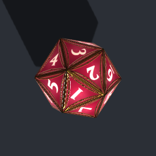
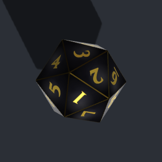
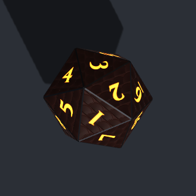
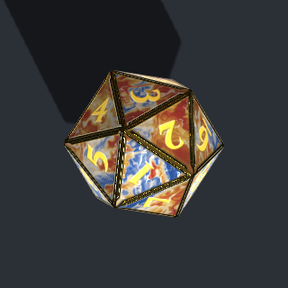
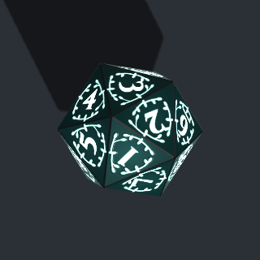
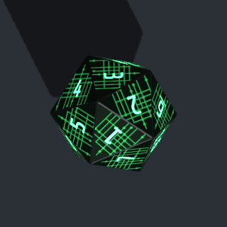
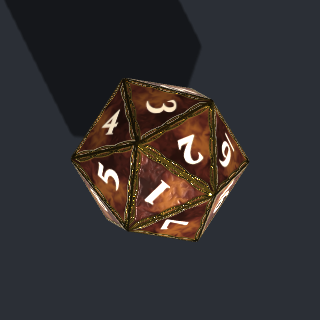
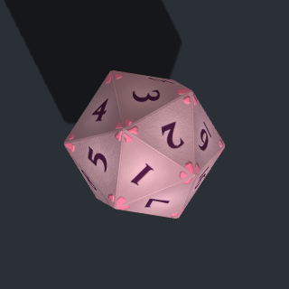

# 🎲 Open Dice DnD

A 3D physics-based dice rolling engine built with Three.js and Cannon-es. Designed for tabletop tools, RPG apps, and game UIs.

## ✨ Features

- 🎯 Physics-based rolling with authoritative pre-determined results (server-friendly)
- 🎨 All standard RPG dice — d4, d6, d8, d10, d12, d20, d100
- 🎬 Smooth animations + shadow rendering
- 🎭 Mid-roll dice additions, multi-batch concurrent rolls
- 🖼️ Custom SVG face decals (per face value, with scale/offset/rotation)
- 🔊 Collision sound effects with impact-based volume
- 🎆 9 spell-school damage-type effects: fire, frost, electric, acid, psychic, necrotic, radiant, thunder, slashing (plus blood splat)
- 🌟 7 settled-state effects: glow, scale pulse, halo ring, screen shake, slow-mo zoom, particle burst, confetti
- 🧠 Declarative rule-based effect composition (match by type/value, play combos)
- 🔒 Secret roll mode
- 🌈 Per-die colors (body, text, background)
- 💎 Dice sets — ten built-in looks (gem, glass, hide, marble pour, circuit, knotwork, felt) plus the classic default; register your own as data with procedural patterns, decoration layers, face emblems and image textures
- 📦 Lightweight, modular, no UI framework lock-in

---

## 📦 Installation

```bash
npm install open-dice-dnd
```

`three` and `cannon-es` are peer dependencies — install them too if you don't already have them.

```bash
npm install three cannon-es
```

---

## 🚀 Quick Start

```js
import { DiceRoller } from 'open-dice-dnd';

const diceRoller = new DiceRoller({
    container: document.getElementById('dice-container'),
    onRollComplete: (total) => console.log('Total:', total),
});

await diceRoller.roll([
    { dice: 'd20', rolled: 15 },
    { dice: 'd6',  rolled: 4 },
]);
```

---

## 📖 API

### Constructor

```js
new DiceRoller({
    container,           // HTMLElement (required)
    width,               // number, defaults to container width
    height,              // number, defaults to container height
    throwSpeed,          // number, default 15
    throwSpin,           // number, default 20
    onRollComplete,      // (total, result) => void
    onBatchSettled,      // (batch, result, roller) => void
    sounds,              // string[] of audio URLs (collision sfx)
    soundVolume,         // number 0..1, default 1
    effects,             // rule list — see "Settled Effects"
    pixelRatio,          // number, default min(devicePixelRatio, 2); pass 1 to opt out
})
```

### Roll methods

| Method | Returns | Behavior |
|---|---|---|
| `roll(diceConfig)` | `Promise<number>` (total) | Clear scene, roll fresh batch |
| `addDice(diceConfig)` | `Promise<{total, variances, results}>` | Add dice to active or settled scene, independent batch |
| `reset()` | `Promise<void>` | Fade out and clear all dice |
| `getCurrentResults()` | `{total, variances, results}` | Re-evaluate every die in the scene |
| `isRolling()` | `boolean` | True if any batch is still unresolved |
| `setEffectRules(rules)` | `void` | Replace settled-effect rules at runtime |
| `preloadDecals(srcs)` | `Promise` | Cache decal images before first roll |
| `setThrowSpeed(n)` | `void` | |
| `setThrowSpin(n)` | `void` | |
| `destroy()` | `void` | Tear down WebGL, listeners, physics |

### Dice config

Each entry in the `diceConfig` array passed to `roll()` / `addDice()`:

```js
{
    dice: 'd20',                 // 'd4' | 'd6' | 'd8' | 'd10' | 'd12' | 'd20' | 'd100'
    rolled: 18,                  // optional target value (authoritative)
    diceColor: 0xff6b6b,         // optional numeric hex — body color
    textColor: '#ffffff',        // optional hex string — face text color
    backgroundColor: '#4ecdc4',  // optional hex string — face background color
    isSecret: false,             // optional — replace numbers with '?'
    decals: {                    // optional — see Decals section
        '1': { src: '/sword.svg', scale: 0.7 },
    },
    effects: [                   // optional — roll-time effects (fire, frost, etc.)
        effects.fire(),
    ],
}
```

### Result shape

`onRollComplete(total, result)` and `addDice()`/`getCurrentResults()` return:

```js
{
    total: 47,           // authoritative sum (predetermined target values)
    variances: [         // dice whose visible face differs from authoritative
        { type: 'd6', expected: 6, visible: 4 },
    ],
    results: [           // per-die details
        { type: 'd6', value: 6, visible: 4, target: 6 },
        ...
    ],
}
```

**Authoritative vs. visible**: the engine pre-simulates each roll in an isolated physics world to determine which face will land up, then paints the target value onto that face. The `total` is always the predetermined sum. If a die gets bumped (e.g. by `addDice()`) and lands on a different face, that's reported as a *variance* but the total is unchanged. This keeps results consistent across clients with different screen aspect ratios.

---

## 🖼️ Decals

Replace number text on specific face values with SVG images.

```js
// Optional preload — eliminates "text first, decal swap" on first roll
await diceRoller.preloadDecals([
    '/icons/sword.svg',
    '/icons/shield.svg',
]);

await diceRoller.roll([{
    dice: 'd6',
    rolled: 4,
    decals: {
        '1': { src: '/icons/sword.svg', scale: 0.7, offsetX: 0, offsetY: 0, rotation: 0 },
        '2': { src: '/icons/shield.svg', scale: 0.9 },
    },
}]);
```

Keys are face *values* (as strings), not face indices. Decals follow the target-rolled face-swap automatically. For d4, the lookup is per-corner (a face shows three corner values); for every other die, it's per-face.

---

## 💎 Dice sets

A dice set is a named look: body finish, edge metal, numeral style and optional face decoration, rendered with physically based materials and reflections. Ten sets ship with the library; `classic` is the original look and stays the default.

| id | look |
|---|---|
| `classic` | The original flat-colour dice. Honours `diceColor`, `textColor`, `backgroundColor`. |
| `ruby-jewel` | Translucent ruby, gold filigree, engraved serif numerals. |
| `emerald-jewel` | Emerald variant of Ruby Jewel. |
| `sapphire-jewel` | Sapphire variant of Ruby Jewel. |
| `obsidian-gold` | Black glass, gold inlaid numerals, gold edges. |
| `ember-dragonhide` | Dark scaled hide, iron edges, glowing ember numerals. |
| `tidepool-pour` | Poured marble in navy, cream, gold and rust with cream lacing, every face different; gold inlay numerals, gold frame and edges. |
| `witchlight-vines` | Deep teal body wreathed in glowing pale-mint vines, mint glow numerals, silver edges. |
| `mainframe` | Near-black green body with glowing circuit traces, green monospace glow numerals, iron edges. |
| `rosewood-knotwork` | Rosewood pour with a gold knotwork border, engraved cream numerals, a gold sunburst emblem on the 20, gold edges. |
| `rose-felt` | Dusty pink felt, matte with no edge metal, darker rose corner ornaments, engraved plum numerals. |

  

    

```js
import { DiceRoller, listDiceSets, registerDiceSet } from 'open-dice-dnd';

const roller = new DiceRoller({ container, set: 'ruby-jewel' });   // default for every die
await roller.preloadSets(['ruby-jewel', 'obsidian-gold']);          // optional: paint ahead of the first roll

await roller.roll([
    { dice: 'd20', rolled: 18, set: 'emerald-jewel' },               // per-die override
    { dice: 'd6',  rolled: 4 },                                      // roller default
]);

roller.setDefaultSet('obsidian-gold');                              // change at runtime
listDiceSets();   // [{ id, name, family, swatch }, ...] for a picker
```

Rules:

- Sets other than `classic` ignore `diceColor`, `textColor` and `backgroundColor`; their palette is the design.
- `decals` and `isSecret` work with every set.
- An unknown set id logs one warning and renders `classic`, so a stale id can never break a roll.
- The first roll that uses a set waits a few milliseconds for the numeral font and the reflection map. `preloadSets()` moves that cost to page load.
- Using `createDie(type, ..., { set })` directly, without a roller (for example to draw a picker preview), paints faces as soon as it is called. Await `prepareDiceSets({ renderer, scene })` first so the numeral font and the reflection environment are ready; textures painted before the font loads use a system serif and are cached separately.

### Custom sets

```js
registerDiceSet({
    id: 'house-brass',
    name: 'House Brass',
    family: 'metal',                                   // gem | glass | metal | textured
    body: { color: '#8C6A2F' },
    edge: { metal: 'bronze' },                         // gold | silver | bronze | iron | none
    numeral: { color: '#1A1208', style: 'engraved' },  // flat | engraved | inlay | glow
    decor: { art: 'filigree', metal: 'bronze', relief: 0.5 },
    swatch: ['#8C6A2F', '#B07A3A'],
});
```

Every field a built-in set uses is available; see `src/sets/builtin/` for the five shipped definitions and `src/sets/validate.js` for the accepted ranges. Textures are 256 px canvases painted once per set, die type and face value, then cached; `clearDiceSetCaches()` frees them.

### Patterns

`body.texture` paints a procedural pattern under everything else. Seven kinds are available; the first four are unchanged from 1.4.

| kind | fields | look |
|---|---|---|
| `noise`, `marble`, `veins`, `scales` | `color2` (required), `contrast` 0..1 (0.3), `scale` 1..12 (3) | The body colour blended toward `color2` by a noise, marble, vein or scale field, as in 1.4. |
| `pour` | `palette` of 2 to 6 hex colours, `warp` 0..8 (4), `scale` 1..12 (3), optional `lacing: { color, width 0.005..0.1 (0.02) }` | Acrylic-pour swirls that run through the whole palette. `lacing` adds thin bright veins between the colours. |
| `circuit` | `color2` (trace colour, required), `density` 5..120 (40), `grid` 6..24 (12), `contrast` 0..1 (0.6) | Printed-circuit traces with pads at their ends on a lattice. The traces are also the glow mask for `body.emissive`. |
| `felt` | `color2` (grain colour, default: the body colour shaded 35 % darker), `contrast` 0..1 (0.3) | Fine matte grain. Pair it with `vignette` around 0.45 and `roughness: 1` for cloth. |

Every kind accepts `perFace: true`, which seeds the pattern by face value so no two faces of a die match (the first paint then costs one pattern per face instead of one per die type). Patterns are deterministic: a definition paints the same pixels on every machine, every time.

Two body fields finish the look:

- `body.emissive: { color, intensity 0..4 }` lights the pattern's glow mask: the traces of `circuit`, or wherever another kind's pattern value is above 0.5. It stacks with `glow` numerals and glowing decoration layers; the brightest of the three sets the material's emissive intensity and the others are painted relative to it, so nothing clips.
- `body.vignette` 0..1 darkens the face toward its edge in `depthColor`. Gem and glass default to 0.85 (their existing look); every other family defaults to 0.

### Decoration layers

`decor` is one layer or an array of up to six, painted in order. A layer takes one of three forms:

```js
decor: [
    { art: 'frame', metal: 'silver', relief: 0.5 },                       // metal art, as in 1.4
    { art: 'vines', color: '#CDEFEB', relief: 0.3, glow: 0.6 },           // flat colour; glow adds it to the emissive map
    { image: { src: '/art/filigree.png' }, metal: 'gold', relief: 0.6 },  // a PNG with alpha, painted as metal (or with color)
]
```

Each layer has exactly one of `metal` (gold | silver | bronze | iron) or `color`. `relief` 0..1 (0.6) raises the art in the normal map, `scale` 0.5..2 (1) resizes it, and `glow` 0..4 (0) is for colour layers only: a metal layer cannot glow. Metal layers paint into the metalness-roughness map; colour layers are dielectric and paint into the albedo (and the emissive map when they glow); image layers draw the image as supplied, or its alpha filled with `color`, and use the alpha as the metal and relief mask. Built-in arts:

| art | shapes | content |
|---|---|---|
| `filigree` | all but kite | Edge bands, corner knots, vines and berries (the 1.4 art). |
| `frame` | all but kite | The filigree's edge bands and corner knots alone, for a plain border or to stack another art inside. |
| `corners` | all but kite | A floret at each corner: three petal discs and a centre dot. |
| `knotwork` | tri, square, pent | A two-strand braid along each edge, the strands crossing, with corner knots. |
| `vines` | all but kite | A vine from each edge midpoint toward the centre with two levels of branches and leaf tips, seeded per shape. |

Kites (d10 and d100) get no built-in decoration: their textured face is only the upper triangle of the kite. A 1.4 definition with a single `decor` object still validates and paints exactly as before.

### Face emblems

`emblems` replaces the numeral on chosen face values with path art, painted with metal and relief like a decoration layer:

```js
emblems: {
    '20': { art: 'sunburst', metal: 'gold', scale: 0.9, relief: 0.5 },
    '1': 'skull',                                    // shorthand: numeral colour, scale 0.8
}
```

Keys are face values as strings, looked up per corner on the d4. The d100 pair never carries an emblem: a percentile roll is read from two faces, and an emblem on either would hide a digit (a decal can still replace a face there, per roll). Built-in emblems: `sunburst`, `star`, `crown`, `skull`. An emblem takes `metal` or `color` (default: the numeral colour), `scale` 0.3..1.2 (0.8) and `relief` 0..1 (0.5), and is painted into every map the numeral would have used; a face that carries an emblem gets its own normal map, so `relief` raises it like a decoration layer. A decal on the same value wins over the emblem: the host's explicit icon beats the set's.

### Image textures

Any look you can paint can be a set:

```js
registerDiceSet({
    id: 'walnut',
    name: 'Walnut',
    family: 'textured',
    body: {
        color: '#5A4634',
        texture: { kind: 'noise', color2: '#3A2A1C' },                                // painted until the image arrives
        image: { src: 'https://cdn.example.com/dice/walnut.jpg', fit: 'cover' },   // or fit: 'tile', scale: 2
        normalImage: { src: 'https://cdn.example.com/dice/walnut-normal.png' },
    },
    edge: { metal: 'bronze' },
    numeral: { color: '#F3E7CF', style: 'engraved' },
    decor: [{ image: { src: '/art/sigil.png' }, metal: 'bronze', relief: 0.5 }],
    swatch: ['#5A4634', '#8A6A4A'],
});
```

- `body.image` replaces the pattern as the albedo base. `cover` scales the image to fill the face texture; `tile` repeats it `scale` (0.25..8) times across the face. Vignette, decoration and numerals paint on top as usual. The `textured` family still requires a `body.texture`; it is what the face shows until the image loads.
- `body.normalImage` is a tangent-space normal map used in place of the generated relief; decoration relief is still composited over it.
- Decoration image layers are PNGs with alpha, painted as metal or colour (see Decoration layers).

Images load through the roller's `DecalRegistry` with `crossOrigin = 'anonymous'`, so a cross-origin host must answer with `Access-Control-Allow-Origin`; without that header the browser refuses to let the canvas read the image and it counts as failed. A face whose images have not arrived paints without them (its pattern or plain body colour) and repaints when they land; a failed image logs one warning per `src` and the fallback stays. To avoid the swap, preload: `await roller.preloadSets(['walnut'])` loads every image the set references before painting, and `prepareDiceSets({ renderer, scene, decalRegistry, sets: ['walnut'] })` does the same for `createDie` used without a roller (pass the roller's `decalRegistry` or your own `DecalRegistry`; without one, faces paint their fallback and nothing is scheduled).

### Custom art

Register your own decoration arts and emblems as SVG path data, before the sets that use them:

```js
import { registerDecorArt, registerEmblemArt, registerDiceSet } from 'open-dice-dnd';

registerDecorArt('house-sigil', {
    tri:    [{ d: 'M -0.5 -0.3 L 0.5 -0.3 L 0 0.6 Z', stroke: 0, fill: true }],
    square: [{ d: 'M -0.6 -0.6 L 0.6 -0.6 L 0.6 0.6 L -0.6 0.6 Z', stroke: 0.05, fill: false }],
    // triCorners (d4) and pent (d12) left out: those faces paint nothing from this art
});

registerEmblemArt('house-mark', [
    { d: 'M 0 1 L 0.95 -0.3 L -0.95 -0.3 Z M 0 0.4 L 0.3 -0.1 L -0.3 -0.1 Z', stroke: 0, fill: true, rule: 'evenodd' },
]);

registerDiceSet({
    // ...body, edge, numeral, swatch...
    decor: [{ art: 'house-sigil', metal: 'bronze' }],
    emblems: { '20': 'house-mark' },
});
```

Decoration art is drawn in the **unit frame**: the face polygon's vertices lie on the unit circle, vertex 0 at (1, 0), y up, and the painter maps that frame onto the face of each die type. The shapes are `tri` (d8, d20), `triCorners` (the d4, whose three numerals sit at the corners), `square` (d6), `pent` (d12) and `kite` (d10, d100). Emblem art is drawn in a unit circle (radius 1, centred, y up) and scaled by the emblem's `scale`.

Each path is `{ d, stroke, fill, rule? }`. `d` may use only the SVG commands `M L H V C S Q T A Z` (uppercase or lowercase) and numbers. A fill path has `fill: true` and stroke 0; a stroke path has `fill: false` and a positive `stroke` width in frame units (the built-ins use 0.02 to 0.06). `rule: 'evenodd'` cuts holes. Ids are kebab-case, a built-in id cannot be replaced, and registration throws on the first invalid path without storing anything, so an art never half-registers. `registerDiceSet` checks that every `art` a set names exists.

### Fonts

Two numeral families are embedded, subset to the digits and `?` under the SIL Open Font License: `OpenDiceNumerals`, the engraved serif every set used until now (the default), and `OpenDiceMono`, a monospace for circuit and console looks. `numeral.font` takes either name, or any other family name verbatim for the browser to resolve (loading that font is up to you). `ensureNumeralFont()` loads both embedded families; faces painted before they load use the system fallback and are cached separately.

---

## 🔊 Sounds

Pass an array of audio URLs and the engine plays a random one per dice collision, with volume scaled to impact velocity. WAV and OGG both work.

```js
new DiceRoller({
    container,
    sounds: ['/sfx/click.ogg', '/sfx/clack.ogg', '/sfx/clock.ogg'],
    soundVolume: 0.6,
});
```

Browser autoplay restrictions mean the *first* roll on page load may be silent until the user clicks once.

---

## 🎆 Animation Effects

Two kinds of effect:

1. **Roll-time effects** — attached via `dice.effects: [...]` per-die config. Run while the die is in motion (fire, frost, etc.), terminate cleanly after settle.
2. **Settled-state effects** — declared via `effects: [...]` constructor option as a rules list. Played when a die settles, based on its result (crit-hit glow, variance amber, etc.).

### Roll-time damage-type effects

All ten are roll-time effects with `scope: 'die'`. Drop into any die's `effects: [...]`.

```js
import { effects } from 'open-dice-dnd';

diceRoller.roll([
    { dice: 'd20', effects: [effects.fire()] },
    { dice: 'd6',  effects: [effects.frost(), effects.bloodSplat()] },
    { dice: 'd8',  effects: [effects.electric()] },
    { dice: 'd10', effects: [effects.psychic()] },
    { dice: 'd12', effects: [effects.necrotic()] },
]);
```

| Effect | Description |
|---|---|
| `fire(options)` | Flickering flame puff particles rising from die, color shifts white-hot → yellow → orange → red ember |
| `frost(options)` | Snowflake crystals + cold mist + 3D ice shards flying outward; leaves dendrite frost patches on floor |
| `electric(options)` | Forked lightning bolts arcing outward during roll; **post-settle, arcs between nearby settled electric dice for ~2-3 s** |
| `acidSplat(options)` | Bright green drips → puddle decals on floor → fizzing smoke wisps |
| `bloodSplat(options)` | Deep red drips → irregular splat decals that linger then fade |
| `psychic(options)` | Multi-color drifting glow orbs + expanding concentric ring "thought waves" |
| `necrotic(options)` | Sine-curving dark purple waveforms + glowing soul motes pulled INWARD into the die |
| `radiant(options)` | Golden god-rays radiating outward + 4-point star sparkles + pulsing floor halo |
| `thunder(options)` | Heavy concussive shockwave rings + warm dust drift |
| `slashing(options)` | Zoro-style sword strikes — single / X / Z patterns, tapered red blade silhouettes |

### Settled-state effects

Use the `effects: [...]` constructor option with match-rules:

```js
import { DiceRoller, effects, presets } from 'open-dice-dnd';

new DiceRoller({
    container,
    effects: [
        { match: { type: 'd20', visible: 20 }, play: [
            effects.glow({ color: 0xfacc15 }),
            effects.haloRing(),
            effects.confetti(),
            effects.slowMoZoom(),
        ]},
        { match: { type: 'd20', visible: 1 }, play: [
            effects.glow({ color: 0xef4444 }),
            effects.screenShake({ intensity: 0.6 }),
        ]},
        { match: 'clean',    play: effects.glow({ color: 0x4ade80 }) },
        { match: 'variance', play: effects.glow({ color: 0xfb923c }) },
    ],
});
```

**`match` clause** accepts:
- `'any'` (or omitted) — always match
- `'clean'` — visible face === authoritative value
- `'variance'` — divergence
- `{ type, visible, value, target }` — partial object match
- `(perDieResult, die) => boolean` — custom predicate

**Each effect spec** has `scope: 'die'` (per-die) or `scope: 'once'` (one per batch, e.g. screen-shake / slow-mo zoom).

#### Settled-state primitives

| Effect | Description |
|---|---|
| `glow({ color, duration, intensity })` | Per-face emissive pulse |
| `scalePulse({ peak, duration })` | Mesh scale bounce |
| `haloRing({ color, duration, startRadius, endRadius })` | Expanding torus on the floor |
| `screenShake({ intensity, duration })` | Camera offset decay (scope: 'once') |
| `slowMoZoom({ duration, zoomLevel })` | Camera focus + zoom hold (scope: 'once') |
| `particleBurst({ color, count })` | Gradient-sprite spark burst |
| `confetti({ colors, count })` | Rotating multicolor rectangles |

#### Presets

```js
import { presets } from 'open-dice-dnd';

new DiceRoller({ effects: presets.classicCrit });  // RPG style with crit/fail
new DiceRoller({ effects: presets.subtle });       // gentle color confirmation only
new DiceRoller({ effects: presets.festive });      // confetti on every clean roll
```

### Imperative effect API

For ad-hoc effect triggering outside the rule system:

```js
diceRoller.glow(die, { color: 0xff0000 });
diceRoller.scalePulse(die);
diceRoller.haloRing(die);
diceRoller.playEffect(effects.confetti(), die);
```

### Writing your own effect

An effect is a factory that returns `{ scope, create(ctx) → { update(), cleanup() } }`:

```js
function myFlash({ color = 0xffffff } = {}) {
    return {
        scope: 'die',
        create({ die, roller }) {
            // Build whatever Three.js objects you need.
            const startTime = performance.now();
            return {
                update() {
                    if (performance.now() - startTime > 500) return true;  // done
                    // mutate scene per frame
                    return false;
                },
                cleanup() { /* called if the dice are cleared mid-effect */ },
            };
        }
    };
}

// Use it in a rule or directly in a die config.
new DiceRoller({
    effects: [{ match: 'clean', play: myFlash({ color: 0xff00ff }) }],
});
```

---

## 🎲 Dice types

| Type | Range |
|---|---|
| `d4` | 1–4 |
| `d6` | 1–6 |
| `d8` | 1–8 |
| `d10` | 0–9 |
| `d12` | 1–12 |
| `d20` | 1–20 |
| `d100` | 0–99 (two d10s) |

---

## 🔄 Migrating from 1.1.x to 1.2.0

**No breaking changes.** Every 1.1.x call still works. The 1.2.0 upgrade is purely additive.

### Existing code keeps working

```js
// 1.1.x — still works in 1.2.0
const total = await diceRoller.roll([{ dice: 'd20' }]);

// onRollComplete still receives total as the first arg
new DiceRoller({
    onRollComplete: (total) => { ... }
});
```

### New things you can opt into

**Richer result info** — `onRollComplete` now receives a second argument:
```js
new DiceRoller({
    onRollComplete: (total, result) => {
        console.log(result.variances);   // dice that diverged from target
        console.log(result.results);     // per-die details
    }
});
```

**Add dice mid-roll** — `addDice()` returns an independent promise with full result:
```js
await diceRoller.roll([{ dice: 'd20', rolled: 20 }]);
// before the d20 settles:
const { total, variances } = await diceRoller.addDice([{ dice: 'd6', rolled: 4 }]);
```

**Sounds + effects** — new constructor options:
```js
import { DiceRoller, effects, presets } from 'open-dice-dnd';

new DiceRoller({
    container,
    sounds: ['/sfx/click.ogg'],     // NEW
    soundVolume: 0.6,                // NEW
    effects: presets.classicCrit,    // NEW
});
```

**Per-die effects** — slot into the dice config:
```js
await diceRoller.roll([
    { dice: 'd20', rolled: 20, effects: [effects.fire()] },  // NEW
]);
```

**Decals** — slot into the dice config:
```js
await diceRoller.roll([
    { dice: 'd6', rolled: 6, decals: {                       // NEW
        '6': { src: '/icons/skull.svg', scale: 0.75 },
    }},
]);
```

### Bug fixes worth knowing

- **d12 face 12 reporting fix** — `getDieValue` used to return `NaN` when a d12 settled on its "12" face without a target value. Now returns `12` correctly.
- **Defensive callback wrapping** — a buggy `onRollComplete` callback that throws no longer brings down the animate loop.

### Effect API stability

The effect factories and rule system are new in 1.2.0 and not finalized for stability. Future versions may iterate on options/defaults. The core `DiceRoller` class API (`roll`, `addDice`, `reset`, etc.) is stable.

---

## 🛠️ Development

```bash
# Run the demo
npm run dev
# Then open http://localhost:5173/demo/

# Build the library
npm run build:lib

# Build the demo for deployment
npm run build
```

---

## 📝 Changelog

### [1.5.0] - 2026-10-03

- Three new procedural patterns: `pour` (marbled pour with optional lacing), `circuit` (seeded traces and pads, also the emissive mask) and `felt`; every pattern accepts `perFace` for a different seed on each face
- Glowing bodies: `body.emissive` lights the pattern itself; `body.vignette` is now a tunable field
- Decoration becomes a list of up to six layers: metal arts, flat-colour arts with optional glow, and image layers; new built-in arts `frame`, `corners`, `knotwork` and `vines`
- `emblems` replace the numeral on chosen face values with path art (built-in `sunburst`, `skull`, `star`, `crown`), painted with metal or colour and relief; the d100 pair never carries one, so percentile rolls stay readable
- Image textures: `body.image` and `body.normalImage` paint a set from PNGs, preloaded with `preloadSets()` and repainted when they arrive; a set without a roller paints its fallback and never throws
- Second embedded numeral font `OpenDiceMono`; `numeral.font` takes either embedded family or any name for the browser to resolve
- `registerDecorArt()` and `registerEmblemArt()` accept SVG path data for your own borders and emblems
- Five new built-in sets: Tidepool Pour, Witchlight Vines, Mainframe, Rosewood Knotwork, Rose Felt
- 1.4.0 set definitions validate and paint unchanged; Classic stays pixel-identical and the five 1.4.0 sets keep their look

### [1.4.0] - 2026-10-03

- 💎 Dice sets: `set` option on the roller and per die, `preloadSets()`, `setDefaultSet()`, `listDiceSets()`, `registerDiceSet()`
- Five built-in sets: Ruby, Emerald and Sapphire Jewel, Obsidian & Gold, Ember Dragonhide
- Physically based materials with a procedural reflection environment; the chamfer bevels become a metal frame on set dice
- Face textures are cached across rolls (classic included); prediction dice no longer paint textures
- Classic dice are unchanged

### [1.2.0] - 2026

#### ✨ New Features

**Mid-roll dice management:**
- `addDice(config)` — throw new dice into an active or settled scene as an independent batch with its own promise
- `getCurrentResults()` — re-evaluate every die in the scene at any time
- `isRolling()` — check if any batch is still unresolved
- `onBatchSettled` constructor callback

**Result reporting:**
- `onRollComplete(total, result)` now passes the full result object as a second argument
- `result.variances` exposes dice whose visible face diverged from the authoritative target
- `result.results` per-die breakdown of authoritative vs. visible values

**Decals:**
- SVG face decals via `dice.decals: { '1': { src, scale, offsetX, offsetY, rotation } }`
- `preloadDecals(srcs)` to cache images before first roll
- All dice supported including d4 (per-corner decal placement)

**Sounds:**
- `sounds: string[]` constructor option for collision audio
- Random pick per collision, volume scaled to impact velocity
- Per-die throttling so settling doesn't buzz

**Effects system:**
- 10 damage-type roll-time effects: `fire`, `frost`, `electric`, `acid` + `bloodSplat` + `acidSplat`, `psychic`, `necrotic`, `radiant`, `thunder`, `slashing`
- 7 settled-state primitives: `glow`, `scalePulse`, `haloRing`, `screenShake`, `slowMoZoom`, `particleBurst`, `confetti`
- 3 built-in presets: `classicCrit`, `subtle`, `festive`
- Declarative rule system: `effects: [{ match, play }]`
- Imperative API: `diceRoller.glow(die, opts)`, `diceRoller.playEffect(spec, die)`
- Extensible: write your own effect by exporting a factory with `scope` + `create()`

**Highlights of individual effects:**
- `electric` arcs jagged forked bolts during roll; **post-settle, settled electric dice within 6 units arc to each other for ~2.5 s**
- `frost` emits real 3D tapered octahedron ice shards alongside snowflake sprites
- `necrotic` pulls sine-curving dark waveforms INWARD into the die (inverse of every other effect)
- `slashing` draws Zoro-style single / X / Z patterns with custom-tapered tube geometry (blade silhouettes)
- `radiant` orients god-rays correctly under the top-down ortho camera

#### 🐛 Bug Fixes

- **d12 face 12 reporting** — `getDieValue` returned `NaN` when a d12 settled on its "12" face without a target. Now correctly returns `12`. Pre-existing bug since v1.0.0.
- **onRollComplete crashes** — a throwing callback no longer kills the animate loop.

#### 🔧 Internal Architecture

- Pre-simulation moved from the live physics world to an isolated `CANNON.World` per roll — `addDice()` mid-flight doesn't perturb the in-progress simulation
- Single-phase animation loop with per-batch settlement tracking
- Per-die `collide` listener for impact-scaled audio
- Effects subsystem with cleanup hooks for scene-attached helpers (geometry/material disposal)
- Module-level settled-electric registry powers cross-die arcing without engine coupling

### [1.1.2] - 2025-10-25

- Fix: Add `isSecret` parameter support to DiceRoller API

### [1.1.1] - 2025-10-23

- Bump version

### [1.1.0] - 2025-10-19

- 🌈 Custom dice colors (`diceColor`, `textColor`, `backgroundColor`)
- 🔒 Secret roll mode (`isSecret`)

### [1.0.0] - 2025-10-03

- 🎉 Initial release
- Physics-based d4/d6/d8/d10/d12/d20/d100
- Promise-based `roll()` API
- Three.js + Cannon.js / Cannon-es

---

## 📄 License

MIT. See [LICENSE](./LICENSE).

## 🙏 Credits

- [Three.js](https://threejs.org/) — 3D rendering
- [Cannon-es](https://pmndrs.github.io/cannon-es/) — physics
- [Vite](https://vitejs.dev/) — build tool
- [Cinzel](https://github.com/NDISCOVER/Cinzel) by The Cinzel Project Authors (SIL Open Font License 1.1) — numeral font, embedded as a digits-only subset under the family name `OpenDiceNumerals`; licence in `src/sets/fonts/OFL.txt`

---

Made with ❤️ for tabletop gaming.
